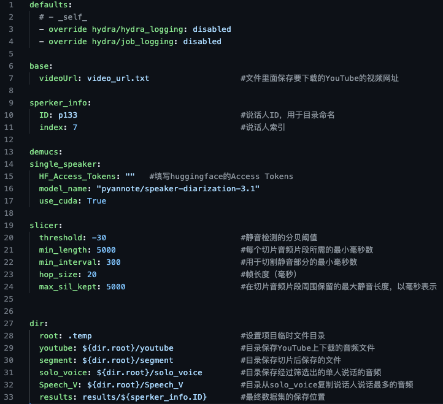

### Auto Audio Data Maker

这个项目是一个简易的Vits（视听跨模态学习）数据集制作工具，旨在帮助用户通过采集YouTube上的音频并进行简单配置，快速、自动化地生成数据集。通过该工具，用户可以轻松地获取所需的语音数据，为Vits等跨模态学习项目提供数据支持。

#### 特点

- 支持从YouTube获取音频数据。
- 提供简单的配置选项，方便用户定制数据集。
- 自动化处理音频数据，包括去除背景音乐、裁剪静音段等。
- 支持单人说话检测，提取单一说话者的音频片段。
- 提供说话人验证功能，将最常见的说话者音频复制到指定目录。
- 支持将语音转换为文本，为语音识别任务提供基础数据。
- 集成了预处理工具，支持对文本数据进行处理，如转换为音素等。
- 这个项目旨在简化数据集的创建过程，为跨模态学习研究提供方便、高效的数据准备工具。

### 如何使用

#### 安装依赖

- 安装必要的系统依赖，如 ffmpeg 和 espeak。在 Ubuntu 系统上，可以使用以下命令安装：
```bash
sudo apt install ffmpe
sudo apt-get install espeak 
```

- 然后你需要将代码克隆到本地
```bash
git clone https://github.com/cnhanbing/AudioDataMaker.git
```

- 最后安装虚拟环境及依赖项：

- Python 3.11

```bash
conda create -n AudioDataMaker python=3.11
pip install -r requirements.txt
```
同时，
#### 运行项目
运行项目需要使用以下命令：
```bash
python main.py
```
#### 项目结构

项目包含以下主要文件和文件夹：

- main.py: 主程序入口，负责处理音频数据的整个流程。
- conf/config.yaml: Hydra配置文件，用于配置项目参数。
- utils.py: 包含用于处理音频数据的各种工具函数。
- scripts/: 包含音频处理的各个模块。

#### 配置文件说明

在conf/config.yaml文件中，你可以配置以下参数：



#### 依赖说明：

该项目使用了以下开源项目：
yt_dlp:用于下载YouTube音频。https://github.com/yt-dlp/yt-dlp
Audio-Slicer: 用于静音裁切音频。https://github.com/openvpi/audio-slicer

### 注意事项

请确保你的Python环境已经安装了所有所需的依赖。
在运行项目之前，请根据需要修改conf/config.yaml文件中的配置参数。

